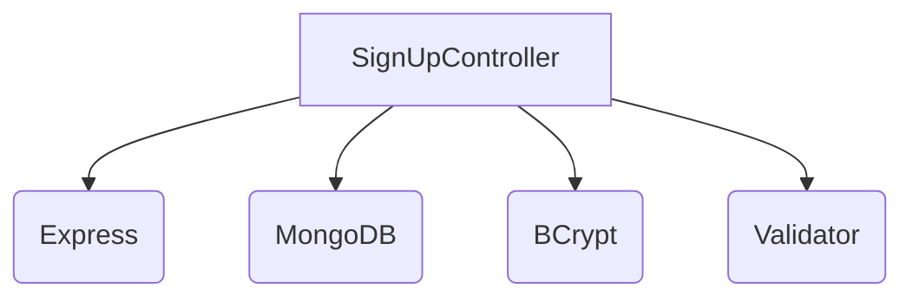

# README
`````# #jj 33


```mermaid
graph TD

    A[SignUpController] --> B(Express)
    A[SignUpController] --> C(MongoDB)
    A[SignUpController] --> D(BCrypt)
    A[SignUpController] --> E(Validator)
```
