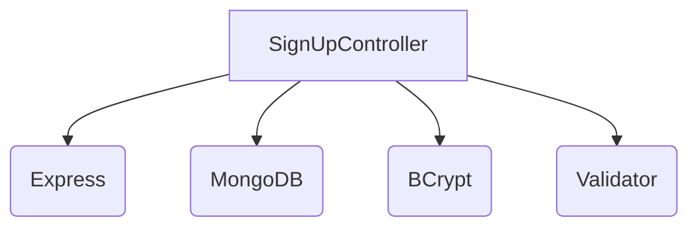
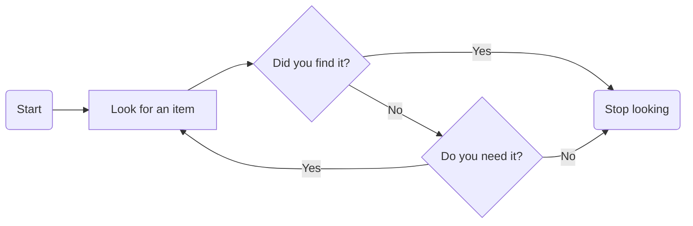

# README
`````# #jj 33


```mermaid
graph TD

    A[SignUpController] --> B(Express)
    A[SignUpController] --> C(MongoDB)
    A[SignUpController] --> D(BCrypt)
    A[SignUpController] --> E(Validator)
```


```mermaid
graph LR

A(Start)
A --> B[Look for an item]
B --> C{Did you find it?}
C -->|Yes| D(Stop looking)
C -->|No| E{Do you need it?}
E -->|Yes| B
E -->|No| D
```
